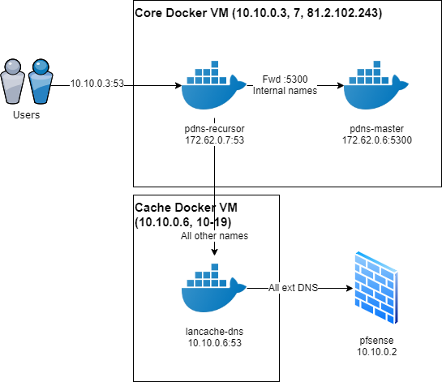

# EPIC.LAN PowerDNS configuration

This `pdns` subfolder contains all Docker images and associated configuration relating to EPIC.LAN's PowerDNS stack which is used internally on MEC's `core` virtual machine to provide internal DNS for events.

The typical DNS flow for EPIC.LAN events looks like this:

172.62.0.0/24 addresses are an internal Docker bridge network as defined in the docker-compose file for the pdns stack.

Users used to hit pdns-master first before queries were recursed back to pdns-recursor and then upstream to cache/internet but PowerDNS 4.0.0's final release removed the recursor functionality. This means that pdns-master becomes an authoritative server for any internal names that are forwarded onto it as defined in pdns-recursor's config. These forward zones can be found in the entrypoint.sh script for pdns-recursor.

